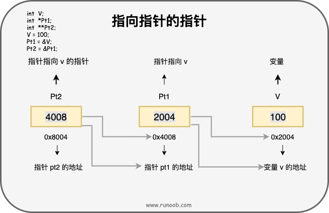

## 基础语法
### C语言标准版本
C语言作为最具影响力的的编程语言从1970年代开始逐渐发展起来，并得到广泛应用，终于在1989年由ANSI 发布了第一个官方标准，继而被ISO 接纳为国际标准，直到今天，历经数十年时间，日趋成熟。下表是C语言标准历次变更情况，在开发中需要根据实际需求选择相应的版本，以获得终端设备的支持。
| 版本 | 发布年份 | 变化内容 |
|---|---|---|
| K&R C | 1978年 | Brian Kernighan 和 Dennis Ritchie 编写了第一版的C语言，因此称为 K&R C |
| **C89 或 C90** | 1989/1990年 | 这是 C 语言的第一个官方标准，最初由 ANSI 发布，后来被 ISO 接纳为国际标准。这个版本也被称为 ANSI C 或 ISO C。它在技术上是完全相同的，只是名称和发布机构不同。 |
| C95 | 1995年 | 这是对 C90 标准的一个小的技术修订版，增加了有向图（digraphs）和宏__STDC_VERSION__。 |
| **C99** | 1999年 | 这是 C 语言的第二个主要标准，引入了多项新特性，包括：新的数据类型、内联函数 (inline)、变长数组 (VLA)、混合声明和代码、复合字面量、泛型选择器 (_Generic)、新的预处理器功能、标准库的增强等。 |
| **C11** | 2011年 | 这是 C 语言的第三个主要标准，增加了对匿名结构体的支持、静态断言、泛型选择（_Generic 关键字）、多线程库以及原子操作支持等新特性。 |
| C17 或 C18 | 2018年 | 这是一个较小的更新，主要是为了修正 C11 中的问题，并做一些澄清和改进，没有引入大量新的功能。有时也被称作“C18”，这是因为 ISO 标准编号中使用的是 2018 年，但技术报告则称为 C17。 |
| C23 | 2023年 | 这是最新的 C 语言标准，在 C17 的基础上进行了一些改进和扩展，引入了新的特性，例如十进制浮点数类型、二进制整数常量、空初始化列表等。 |
### C语言语法结构
在 C 语言中，令牌（Token）是程序的基本组成单位，编译器通过对源代码进行词法分析，将代码分解成一个个的令牌。
C 语言的令牌主要包括以下几种类型：
- 关键字（Keywords）
- 标识符（Identifiers）
- 常量（Constants）
- 字符串字面量（String Literals）
- 运算符（Operators）
- 分隔符（Separators）
### C语言关键字
#### 数据类型关键字
| 关键字      | 用途                                                  |
| -------- | --------------------------------------------------- |
| int      | 整型变量或函数                                             |
| char     | 字符型变量或函数                                            |
| float    | 浮点型变量或函数                                            |
| double   | 双精度变量或函数                                            |
| enum     | 枚举类型                                                |
| short    | 短整型变量或函数                                            |
| long     | 长整型变量或函数                                            |
| signed   | 有符号类型变量或函数                                          |
| unsigned | 无符号类型变量或函数                                          |
| struct   | 结构体变量或函数                                            |
| union    | 联合数据类型                                              |
| void     | 修饰函数，说明函数无返回值；修饰指针，说明指针是不确定数据类型的指针；函数无返回值或无参数，无类型指针 |

#### 存储类型关键字
|关键字|用途|
|---|---|
|auto    |声明自动变量|
|static  |声明静态变量|
|register   |声明存储器变量|
|extern  |声明变量，在其他文件中声明，亦引用变量|

#### 控制语句关键字
|关键字|用途|
|---|---|
|goto |   无条件跳转语句|
|continue |   结束当前循环，开始下一轮循环|
|break |  跳出当前循环或switch结构|
|return | 子程序返回语句，可带或不带参数|
|for |for循环结构|
|do | 循环语句的循环体 |
|while|   循环语句的循环条件 |
|if |  条件语句 |
|else |   条件语句否定分支（与 if 连用） |
|switch | 用于开关语句 |
|case |   开关语句分支 |
|default |开关语句中的“其他”分支，可选|

#### 其他关键字
|关键字|用途|
|---|---|
|const |  声明只读变量 |
|sizeof|  计算对象所占内存空间大小|
|typedef| 给数据类型取别名|
|volatile|    说明变量在程序执行中可被隐含地改变|
### C语言基本数据类型
在 C 语言中，数据类型指的是用于声明不同类型的变量或函数的一个广泛的系统。变量的类型决定了变量存储占用的空间，以及如何解释存储的位模式。
- 基本数据类型：它们是算术类型，包括整型（int）、字符型（char）、浮点型（float）和双精度浮点型（double）。
- 枚举类型：它们也是算术类型，被用来定义在程序中只能赋予其一定的离散整数值的变量。
- void 类型：类型说明符 void 表示没有值的数据类型，通常用于函数返回值。
- 派生类型：包括数组类型、指针类型和结构体类型。
#### 整数类型(Integer types)
|  类型	| 存储大小	 | 值范围 |
|---|---|---|
|char	|1 字节	|-128 到 127 或 0 到 255|
|unsigned char	|1 字节|	0 到 255|
|signed char	|1 字节	|-128 到 127|
|int	|2 或 4 字节	|-32,768 到 32,767 或 -2,147,483,648 到 2,147,483,647|
|unsigned int	|2 或 4 字节	|0 到 65,535 或 0 到 4,294,967,295|
|short	|2 字节	|-32,768 到 32,767|
|unsigned short	|2 字节	|0 到 65,535|
|long	|4 字节	|-2,147,483,648 到 2,147,483,647|
|unsigned long	|4 字节	|0 到 4,294,967,295|
#### 浮点类型(Floating-point types)
|类型	|存储大小	|值范围	|精度|
|---|---|---|---|
|float	|4 字节	|1.2E-38 到 3.4E+38|6 位有效位|
|double	|8 字节	|2.3E-308 到 1.7E+308|15 位有效位|
|long double	|16 字节	|3.4E-4932 到 1.1E+4932|19 位有效位|
#### void 类型(Void type)
void 类型指定没有可用的值。它通常用于以下三种情况下：
- 函数返回为空
C 中有各种函数都不返回值，或者您可以说它们返回空。不返回值的函数的返回类型为空。例如 void exit (int status);
- 函数参数为空
C 中有各种函数不接受任何参数。不带参数的函数可以接受一个 void。例如 int rand(void);
- 指针指向 void
类型为 void * 的指针代表对象的地址，而不是类型。例如，内存分配函数 void *malloc( size_t size ); 返回指向 void 的指针，可以转换为任何数据类型。
#### 类型的存储大小
各种类型的存储大小与操作系统位数有关，为了得到某个类型或某个变量在特定操作系统上的准确大小，您可以使用 sizeof 运算符。表达式 sizeof(type) 得到对象或类型的存储字节大小。
### C语言变量(Variables)
变量其实只不过是程序可操作的存储区的名称。C 中每个变量都有特定的类型，类型决定了变量存储的大小和布局，该范围内的值都可以存储在内存中，运算符可应用于变量上。
#### 变量的定义
变量定义就是告诉编译器在何处创建变量的存储，以及如何创建变量的存储。变量定义指定一个数据类型，并包含了该类型的一个或多个变量的列表，如下所示：
```
type variable_list;
```
type 表示变量的数据类型，可以是整型、浮点型、字符型、指针等，也可以是用户自定义的对象。
variable_list 可以由一个或多个变量的名称组成，多个变量之间用逗号,分隔，变量由字母、数字和下划线组成，且以字母或下划线开头。
#### 变量的名称

#### 变量的初始化
变量的初始化是在定义变量的同时为其赋予一个初始值。变量的初始化可以在定义时进行，也可以在后续的代码中进行。初始化器由一个等号，后跟一个常量表达式组成，如：
```
type variable_name = value;
```
或者
```
type variable_name;    // 变量定义
variable_name = new_value;    // 变量初始化
```
#### 变量的默认值
如果变量没有显式初始化，那么它的默认值将取决于该变量的类型和其所在的作用域。
对于全局变量和静态变量（在函数内部定义的静态变量和在函数外部定义的全局变量），它们的默认初始值为零。
以下是不同类型的变量在没有显式初始化时的默认值：
- 整型变量（int、short、long等）：默认值为0。
- 浮点型变量（float、double等）：默认值为0.0。
- 字符型变量（char）：默认值为'\0'，即空字符。
- 指针变量：默认值为NULL，表示指针不指向任何有效的内存地址。
数组、结构体、联合等复合类型的变量：它们的元素或成员将按照相应的规则进行默认初始化，这可能包括对元素递归应用默认规则。
需要注意的是，局部变量（在函数内部定义的非静态变量）不会自动初始化为默认值，它们的初始值是未定义的（包含垃圾值）。因此，在使用局部变量之前，应该显式地为其赋予一个初始值。
#### extern 关键字
使用 extern 关键字声明的变量是外部变量，表示该变量在其他文件中定义。
extern 关键字在 C 语言中用于声明外部变量或函数，使得它们可以在多个文件中共享和使用。
extern 主要用于实现模块化编程和代码的分离。
extern 变量的声明和定义通常放在不同的文件中。
#### 左值（Lvalues）和右值（Rvalues）
- 左值（lvalue）：指向内存位置的表达式被称为左值（lvalue）表达式。左值可以出现在赋值号的左边或右边。
- 右值（rvalue）：术语右值（rvalue）指的是存储在内存中某些地址的数值。右值是不能对其进行赋值的表达式，也就是说，右值可以出现在赋值号的右边，但不能出现在赋值号的左边。
变量是左值，因此可以出现在赋值号的左边。数值型的字面值是右值，因此不能被赋值，不能出现在赋值号的左边。
### C语言常量
- 字面常量：在程序中单独存在的符号或数字，没有意义，但是可以存在
```
int main()
{
	1000;
	'a';
	3.14;
	
	return 0;
}
```
- const 修饰的常变量：在变量的前面加上const，变量将无法进行修改，可以看作是常量，但是本质上还是变量。
```
#include <stdio.h>
int main()
{
	const int a= 10;
	a = 20;
	printf("%d", a);
	return 0;
}
```
- #define 定义的标识符常量：无法修改是直接给标识符一个数字或者字符串
```
#define M 10
int main()
{
	int arr[M] = { 0,2,3,5};
	printf("%d",arr[M-1]);
	return 0;
}
```
- 枚举常量：可以将变量一一列举，关键词为enum
```
int main()
{
	enum
	{male,female,secret};//括号中的male，female，secret是枚举常量
 
    printf("%d\n", male);
	printf("%d\n", female);
	printf("%d", secret);
	return 0;
}
```
### C语言存储类
存储类定义 C 程序中变量/函数的存储位置、生命周期和作用域。这些说明符放置在它们所修饰的类型之前。
#### auto 存储类
auto 存储类是所有局部变量默认的存储类。定义在函数中的变量默认为 auto 存储类，这意味着它们在函数开始时被创建，在函数结束时被销毁。auto 只能用在函数内，即 auto 只能修饰局部变量。
#### register 存储类
register 存储类用于定义存储在寄存器中而不是 RAM 中的局部变量。这意味着变量的最大尺寸等于寄存器的大小（通常是一个字），且不能对它应用一元的 '&' 运算符（因为它没有内存位置）。
register 存储类定义存储在寄存器，所以变量的访问速度更快，但是它不能直接取地址，因为它不是存储在 RAM 中的。在需要频繁访问的变量上使用 register 存储类可以提高程序的运行速度。
#### static 存储类
static 存储类指示编译器在程序的生命周期内保持局部变量的存在，而不需要在每次它进入和离开作用域时进行创建和销毁。因此，使用 static 修饰局部变量可以在函数调用之间保持局部变量的值。
static 修饰符也可以应用于全局变量。当 static 修饰全局变量时，会使变量的作用域限制在声明它的文件内。
全局声明的一个 static 变量或方法可以被任何函数或方法调用，只要这些方法出现在跟 static 变量或方法同一个文件中。
静态变量在程序中只被初始化一次，即使函数被调用多次，该变量的值也不会重置。
#### extern 存储类
extern 存储类用于定义在其他文件中声明的全局变量或函数。当使用 extern 关键字时，不会为变量分配任何存储空间，而只是指示编译器该变量在其他文件中定义。
extern 存储类用于提供一个全局变量的引用，全局变量对所有的程序文件都是可见的。当您使用 extern 时，对于无法初始化的变量，会把变量名指向一个之前定义过的存储位置。
当您有多个文件且定义了一个可以在其他文件中使用的全局变量或函数时，可以在其他文件中使用 extern 来得到已定义的变量或函数的引用。可以这么理解，extern 是用来在另一个文件中声明一个全局变量或函数。
extern 修饰符通常用于当有两个或多个文件共享相同的全局变量或函数的时候。
### C语言运算符
#### 算术运算符
实例假定变量 A 的值为 10，变量 B 的值为 20
|运算符	|描述	|实例|
|---|---|---|
|+	|把两个操作数相加	|A + B 将得到 30|
|-	|从第一个操作数中减去第二个操作数	|A - B 将得到 -10|
|*	|把两个操作数相乘	|A * B 将得到 200|
|/	|分子除以分母	|B / A 将得到 2|
|%	|取模运算符，整除后的余数	|B % A 将得到 0|
|++	|自增运算符，整数值增加 1	|A++ 将得到 11|
|--	|自减运算符，整数值减少 1	|A-- 将得到 9|
#### 关系运算符
实例假定变量 A 的值为 10，变量 B 的值为 20
|运算符|	描述|	实例|
|---|---|---|
|==	|检查两个操作数的值是否相等，如果相等则条件为真。|	(A == B) 为假。|
|!=	|检查两个操作数的值是否相等，如果不相等则条件为真。|	(A != B) 为真。|
|>	|检查左操作数的值是否大于右操作数的值，如果是则条件为真。|	(A > B) 为假。|
|<	|检查左操作数的值是否小于右操作数的值，如果是则条件为真。|	(A < B) 为真。|
|>=	|检查左操作数的值是否大于或等于右操作数的值，如果是则条件为真。|	(A >= B) 为假。|
|<=	|检查左操作数的值是否小于或等于右操作数的值，如果是则条件为真。|	(A <= B) 为真。|
#### 逻辑运算符
假设变量 A 的值为 1，变量 B 的值为 0.
|运算符	|描述	|实例|
|---|---|---|
|&&	|称为逻辑与运算符。如果两个操作数都非零，则条件为真。	|(A && B) 为假。|
|\|\|	|称为逻辑或运算符。如果两个操作数中有任意一个非零，则条件为真。	|(A \|\| B) 为真。|
|!	|称为逻辑非运算符。用来逆转操作数的逻辑状态。如果条件为真则逻辑非运算符将使其为假。	|!(A && B) 为真。|
#### 位运算符
假设变量 A 的值为 60，变量 B 的值为 13.
|运算符	|描述	|实例|
|---|---|---|
|&|0&0=0;0&1=0;1&0=0;1&1=1;|(A & B) 将得到 12，即为 0000 1100|
|\||0\|0=0;0\|1=1;1\|0=1;1\|1=1;|(A \| B) 将得到 61，即为 0011 1101|
|^|0^0=0;0^1=1;1^0=1;1^1=0;|(A ^ B) 将得到 49，即为 0011 0001|
|~|~1=-2;~0=-1;|(~A ) 将得到 -61，即为 1100 0011，一个有符号二进制数的补码形式。|
|<<|将操作数的所有位向左移动指定的位数。左移 n 位相当于乘以 2 的 n 次方。二进制左移运算符。将一个运算对象的各二进制位全部左移若干位（左边的二进制位丢弃，右边补0）。|A << 2 将得到 240，即为 1111 0000|
|>>|将操作数的所有位向右移动指定的位数。右移n位相当于除以 2 的 n 次方。二进制右移运算符。将一个数的各二进制位全部右移若干位，正数左补 0，负数左补 1，右边丢弃。|A >> 2 将得到 15，即为 0000 1111|
### C语言语句和表达式(Statements and Expressions)
#### 判断结构
判断结构要求程序员指定一个或多个要评估或测试的条件，以及条件为真时要执行的语句（必需的）和条件为假时要执行的语句（可选的）。
C 语言把任何非零和非空的值假定为 true，把零或 null 假定为 false。
- if...else 语句
```
if(boolean_expression 1){
   /* 当布尔表达式 1 为真时执行 */
}else if( boolean_expression 2){
   /* 当布尔表达式 2 为真时执行 */
}else if( boolean_expression 3){
   /* 当布尔表达式 3 为真时执行 */
}else {
   /* 当上面条件都不为真时执行 */
}
```
- 嵌套if...else 语句
```
if( boolean_expression 1){
   /* 当布尔表达式 1 为真时执行 */
   if(boolean_expression 2){
      /* 当布尔表达式 2 为真时执行 */
   }
}
```
- switch 语句
```
switch(expression){
    case constant-expression  :
       statement(s);
       break; /* 可选的 */
    case constant-expression  :
       statement(s);
       break; /* 可选的 */
  
    /* 您可以有任意数量的 case 语句 */
    default : /* 可选的 */
       statement(s);
}
```
- 嵌套switch 语句
```
switch(ch1) {
   case 'A': 
      printf("这个 A 是外部 switch 的一部分" );
      switch(ch2) {
         case 'A':
            printf("这个 A 是内部 switch 的一部分" );
            break;
         case 'B': /* 内部 B case 代码 */
      }
      break;
   case 'B': /* 外部 B case 代码 */
}
```
- ? : 运算符(三元运算符)
```
Exp1 ? Exp2 : Exp3;
//等效于
if(Exp1){
   Exp2
}else{
   Exp3
}
```
#### 循环结构
- while 循环，只要给定的条件为真，C 语言中的 while 循环语句会重复执行一个目标语句。
```
while(condition){
   statement(s);
}
```
- for 循环
```
for ( init; condition; increment ){
   statement(s);
}
```
- do...while 循环，do...while 循环与 while 循环类似，但是 do...while 循环会确保至少执行一次循环。
```
do{
   statement(s);
}while( condition );
```
#### 跳转语句
- break语句

   break 关键字用于立即终止循环，跳出循环体。
- continue语句
  
  continue 关键字用于跳过当前循环的剩余部分，直接进入下一次迭代。
### C语言函数
函数由一个函数头和一个函数主体组成。下面列出一个函数的所有组成部分：
- 返回类型：一个函数可以返回一个值。return_type 是函数返回的值的数据类型。有些函数执行所需的操作而不返回值，在这种情况下，return_type 是关键字 void。
- 函数名称：这是函数的实际名称。函数名和参数列表一起构成了函数签名。
- 参数列表：参数就像是占位符。当函数被调用时，您向参数传递一个值，这个值被称为实际参数。参数列表包括函数参数的类型、顺序、数量。参数是可选的，也就是说，函数可能不包含参数。
- 函数主体：函数主体包含一组定义函数执行任务的语句。
#### 函数的声明
函数声明会告诉编译器函数名称及如何调用函数。函数的实际主体可以单独定义。当您在一个源文件中定义函数且在另一个文件中调用函数时，函数声明是必需的。在这种情况下，您应该在调用函数的文件顶部声明函数。
```
return_type function_name( parameter list );
```
#### 函数的定义
```
return_type function_name( parameter list ){
   body of the function
}
```
#### 调用函数
当程序调用函数时，程序控制权会转移给被调用的函数。被调用的函数执行已定义的任务，当函数的返回语句被执行时，或到达函数的结束括号时，会把程序控制权交还给主程序。
调用函数时，传递所需参数，如果函数返回一个值，则可以存储返回值。
#### 函数参数
如果函数要使用参数，则必须声明接受参数值的变量。这些变量称为函数的形式参数。
形式参数就像函数内的其他局部变量，在进入函数时被创建，退出函数时被销毁。
| 调用类型	|描述  |
| --- | -- |
| 传值调用	| 该方法把参数的实际值复制给函数的形式参数。在这种情况下，修改函数内的形式参数不会影响实际参数。 |
| 引用调用	| 通过指针传递方式，形参为指向实参地址的指针，当对形参的指向操作时，就相当于对实参本身进行的操作。 |

默认情况下，C 使用传值调用来传递参数。一般来说，这意味着函数内的代码不能改变用于调用函数的实际参数。
#### 可变参数
```
int func_name(int arg1, ...);
```
函数 func() 最后一个参数写成省略号，即三个点号（...），省略号之前的那个参数是 int，代表了要传递的可变参数的总数。为了使用这个功能，您需要使用 stdarg.h 头文件，该文件提供了实现可变参数功能的函数和宏。具体步骤如下：
1. 定义一个函数，最后一个参数为省略号，省略号前面可以设置自定义参数。
2. 在函数定义中创建一个 va_list 类型变量，该类型是在 stdarg.h 头文件中定义的。
3. 使用 int 参数和 va_start() 宏来初始化 va_list 变量为一个参数列表。宏 va_start() 是在 stdarg.h 头文件中定义的。
4. 使用 va_arg() 宏和 va_list 变量来访问参数列表中的每个项。
5. 使用宏 va_end() 来清理赋予 va_list 变量的内存。

常用的宏有：
- va_start(ap, last_arg)：初始化可变参数列表。ap 是一个 va_list 类型的变量，last_arg 是最后一个固定参数的名称（也就是可变参数列表之前的参数）。该宏将 ap 指向可变参数列表中的第一个参数。
- va_arg(ap, type)：获取可变参数列表中的下一个参数。ap 是一个 va_list 类型的变量，type 是下一个参数的类型。该宏返回类型为 type 的值，并将 ap 指向下一个参数。
- va_end(ap)：结束可变参数列表的访问。ap 是一个 va_list 类型的变量。该宏将 ap 置为 NULL。
```
#include <stdio.h>
#include <stdarg.h>
 
double average(int num,...)
{
 
    va_list valist;
    double sum = 0.0;
    int i;
 
    /* 为 num 个参数初始化 valist */
    va_start(valist, num);
 
    /* 访问所有赋给 valist 的参数 */
    for (i = 0; i < num; i++)
    {
       sum += va_arg(valist, int);
    }
    /* 清理为 valist 保留的内存 */
    va_end(valist);
 
    return sum/num;
}
 
int main()
{
   printf("Average of 2, 3, 4, 5 = %f\n", average(4, 2,3,4,5));
   printf("Average of 5, 10, 15 = %f\n", average(3, 5,10,15));
}
```
#### 变量作用域
作用域是程序中定义的变量所存在的区域，超过该区域变量就不能被访问。C 语言中有三个地方可以声明变量：
- 在函数或块内部的局部变量：在某个函数或块的内部声明的变量称为局部变量。它们只能被该函数或该代码块内部的语句使用。局部变量在函数外部是不可知的。
```
#include <stdio.h>
 
int main ()
{
  /* 局部变量声明 */
  int a, b;
  int c;
 
  /* 实际初始化 */
  a = 10;
  b = 20;
  c = a + b;
 
  printf ("value of a = %d, b = %d and c = %d\n", a, b, c);
 
  return 0;
}
```
- 在所有函数外部的全局变量：全局变量是定义在函数外部，通常是在程序的顶部。全局变量在整个程序生命周期内都是有效的，在任意的函数内部能访问全局变量。全局变量可以被任何函数访问。局部变量和全局变量的名称可以相同，但是在函数内，如果两个名字相同，会使用局部变量值，全局变量不会被使用。
```
#include <stdio.h>
 
/* 全局变量声明 */
int g;
 
int main ()
{
  /* 局部变量声明 */
  int a, b;
 
  /* 实际初始化 */
  a = 10;
  b = 20;
  g = a + b;
 
  printf ("value of a = %d, b = %d and g = %d\n", a, b, g);
 
  return 0;
}
```
- 在函数参数定义中形式参数，被当作该函数内的局部变量，如果与全局变量同名它们会优先使用。
```
#include <stdio.h>
 
/* 全局变量声明 */
int a = 20;
 
int main ()
{
  /* 在主函数中的局部变量声明 */
  int a = 10;
  int b = 20;
  int c = 0;
  int sum(int, int);
 
  printf ("value of a in main() = %d\n",  a);
  c = sum( a, b);
  printf ("value of c in main() = %d\n",  c);
 
  return 0;
}
 
/* 添加两个整数的函数 */
int sum(int a, int b)
{
    printf ("value of a in sum() = %d\n",  a);
    printf ("value of b in sum() = %d\n",  b);
 
    return a + b;
}
```
### C语言复杂数据结构
#### 数组
数组是用来存储一系列数据，但它往往被认为是一系列相同类型的变量。所有的数组都是由连续的内存位置组成。最低的地址对应第一个元素，最高的地址对应最后一个元素。
- 声明数组
```
type arrayName [ arraySize ]; // 一维数组
type name[size1][size2]...[sizeN]; // 多维数据
```
- 初始化数组
```
double a[] = {1000.0, 2.0, 3.4, 7.0, 50.0};
int b[3][4] = {0,1,2,3,4,5,6,7,8,9,10,11};
```
- 访问数组元素
```C
int item_a = a[0];
int item_b = b[2][3];
```
- 传递数组给函数

   在函数中传递数组时，通常需要传递数组的地址，以便在函数内对数组进行修改。
```
// 形式参数是一个指针
void myFunction(int *param){
...
}
// 形式参数是一个已定义大小的数组
void myFunction(int param[10]){
...
}
// 形式参数是一个未定义大小的数组
void myFunction(int param[]){
...
}
```
- 从函数返回数组
```
// C 语言不允许返回一个完整的数组作为函数的参数。但是，您可以通过指定不带索引的数组名来返回一个指向数组的指针。
int * myFunction(){
...
}
```
#### 枚举(Enumerations)
枚举是 C 语言中的一种基本数据类型，用于定义一组具有离散值的常量，它可以让数据更简洁，更易读。
- 枚举变量的定义
```
// 先定义枚举类型，再定义枚举变量
enum DAY
{
      MON=1, TUE, WED, THU, FRI, SAT, SUN
};
enum DAY day;
// 定义枚举类型的同时定义枚举变量
enum DAY
{
      MON=1, TUE, WED, THU, FRI, SAT, SUN
} day;
// 省略枚举名称，直接定义枚举变量
enum
{
      MON=1, TUE, WED, THU, FRI, SAT, SUN
} day;
```
- 枚举的遍历
枚举类型是被当做 int 或者 unsigned int 类型来处理的，所以按照 C 语言规范是没有办法遍历枚举类型的。不过在一些特殊的情况下，枚举类型必须连续是可以实现有条件的遍历。
```
#include <stdio.h>
 
enum DAY
{
      MON=1, TUE, WED, THU, FRI, SAT, SUN
} day;
int main()
{
    // 遍历枚举元素
    for (day = MON; day <= SUN; day++) {
        printf("枚举元素：%d \n", day);
    }
}
```
#### 字符串
字符串实际上是使用空字符 \0 结尾的一维字符数组。因此，\0 是用于标记字符串的结束。
空字符（Null character）又称结束符，缩写 NUL，是一个数值为 0 的控制字符，\0 是转义字符，意思是告诉编译器，这不是字符 0，而是空字符。

- 字符串操作

| 函数 | 用途 |
| --- | --- |
| strcpy(s1, s2); | 复制字符串 s2 到字符串 s1。|
| strcat(s1, s2); | 连接字符串 s2 到字符串 s1 的末尾。 |
| strlen(s1); | 返回字符串 s1 的长度。 |
| strcmp(s1, s2); | 如果 s1 和 s2 是相同的，则返回 0；如果 s1<s2 则返回小于 0；如果 s1>s2 则返回大于 0。 |
| strchr(s1, ch); | 返回一个指针，指向字符串 s1 中字符 ch 的第一次出现的位置。 |
| strstr(s1, s2); | 返回一个指针，指向字符串 s1 中字符串 s2 的第一次出现的位置。 |

#### 结构体(Structures)
结构是 C 编程中另一种用户自定义的可用的数据类型，它允许您存储不同类型的数据项。
结构体中的数据成员可以是基本数据类型（如 int、float、char 等），也可以是其他结构体类型、指针类型等。
- 结构体的定义
```
struct tag { 
    member-list
    member-list 
    member-list  
    ...
} variable-list ;
```
tag 是结构体标签。
member-list 是标准的变量定义，比如 int i; 或者 float f;，或者其他有效的变量定义。
variable-list 结构变量，定义在结构的末尾，最后一个分号之前，您可以指定一个或多个结构变量。
具体来说，有四种方式：
```
// 方式1
struct Book
{
   char  title[50];
   char  author[50];
   char  subject[100];
   int   book_id;
} book;
//方式2
struct
{
   char  title[50];
   char  author[50];
   char  subject[100];
   int   book_id;
} book;
//方式3
struct Book
{
   char  title[50];
   char  author[50];
   char  subject[100];
   int   book_id;
};
struct Book b1, b2[20], *b3;
//方式4
typedef struct
{
   char  title[50];
   char  author[50];
   char  subject[100];
   int   book_id;
} Book;
//现在可以用Simple2作为类型声明新的结构体变量
Book b1, b2[20], *b3;
```
- 结构体变量的初始化
```
struct Books
{
   char  title[50];
   char  author[50];
   char  subject[100];
   int   book_id;
} book = {"C 语言", "RUNOOB", "编程语言", 123456};
```
- 指向结构的指针
可以定义指向结构的指针，方式与定义指向其他类型变量的指针相似，如下所示：
```
struct Books *struct_pointer; //声明
struct_pointer = &Book1; //初始化
struct_pointer->title; //指向该结构的指针访问结构的成员
```
实例
```
#include <stdio.h>
#include <string.h>
 
struct Books
{
   char  title[50];
   char  author[50];
   char  subject[100];
   int   book_id;
};

/* 函数声明 */
void printBook( struct Books *book );
int main( )
{
   struct Books Book1;        /* 声明 Book1，类型为 Books */
   struct Books Book2;        /* 声明 Book2，类型为 Books */
 
   /* Book1 详述 */
   strcpy( Book1.title, "C Programming");
   strcpy( Book1.author, "Nuha Ali"); 
   strcpy( Book1.subject, "C Programming Tutorial");
   Book1.book_id = 6495407;

   /* Book2 详述 */
   strcpy( Book2.title, "Telecom Billing");
   strcpy( Book2.author, "Zara Ali");
   strcpy( Book2.subject, "Telecom Billing Tutorial");
   Book2.book_id = 6495700;
 
   /* 通过传 Book1 的地址来输出 Book1 信息 */
   printBook( &Book1 );

   /* 通过传 Book2 的地址来输出 Book2 信息 */
   printBook( &Book2 );

   return 0;
}
void printBook( struct Books *book )
{
   printf( "Book title : %s\n", book->title);
   printf( "Book author : %s\n", book->author);
   printf( "Book subject : %s\n", book->subject);
   printf( "Book book_id : %d\n", book->book_id);
}
```
- 结构体大小的计算
可以使用 sizeof 运算符来计算结构体的大小，sizeof 返回的是给定类型或变量的字节大小。
对于结构体，sizeof 将返回结构体的总字节数，包括所有成员变量的大小以及可能的填充字节。
#### 共用体
共用体是一种特殊的数据类型，允许您在相同的内存位置存储不同的数据类型。
- 定义共用体
```
union [union tag]
{
   member definition;
   member definition;
   ...
   member definition;
} [one or more union variables];    
```

#### 位域
C 语言的位域（bit-field）是一种特殊的结构体成员，允许我们按位对成员进行定义，指定其占用的位数。
```
struct
{
  unsigned int widthValidated : 1;
  unsigned int heightValidated : 1;
} status;
```

#### typedef
typedef 关键字，您可以使用它来为类型取一个新的名字。
```
typedef unsigned char BYTE;
```
在这个类型定义之后，标识符 BYTE 可作为类型 unsigned char 的缩写.
- typedef vs #define
#define 是 C 指令，用于为各种数据类型定义别名，与 typedef 类似，但是它们有以下几点不同：
typedef 仅限于为类型定义符号名称，#define 不仅可以为类型定义别名，也能为数值定义别名，比如您可以定义 1 为 ONE。
typedef 是由编译器执行解释的，#define 语句是由预编译器进行处理的。

### C语言类型转换
类型转换是将一个数据类型的值转换为另一种数据类型的值。C 语言中有两种类型转换：
- 隐式类型转换：隐式类型转换是在表达式中自动发生的，无需进行任何明确的指令或函数调用。它通常是将一种较小的类型自动转换为较大的类型，例如，将int类型转换为long类型或float类型转换为double类型。隐式类型转换也可能会导致数据精度丢失或数据截断。
- 显式类型转换：显式类型转换需要使用强制类型转换运算符（type casting operator），它可以将一个数据类型的值强制转换为另一种数据类型的值。强制类型转换可以使程序员在必要时对数据类型进行更精确的控制，但也可能会导致数据丢失或截断。

#### 整数提升
整数提升是指把小于 int 或 unsigned int 的整数类型转换为 int 或 unsigned int 的过程。
```
#include <stdio.h>
 
int main()
{
   int  i = 17;
   char c = 'c'; /* ascii 值是 99 */
   int sum;
 
   sum = i + c;
   printf("Value of sum : %d\n", sum );
 
}
```
#### 常用的算术转换
常用的算术转换是隐式地把值强制转换为相同的类型。编译器首先执行整数提升，如果操作数类型不同，则它们会被转换为下列层次中出现的最高层次的类型：
int -> unsigned int -> long -> unsigned long -> long long -> unsigned long long -> float -> double -> long double
常用的算术转换不适用于赋值运算符、逻辑运算符 && 和 ||。
#### 将整数转换为枚举
```
#include <stdio.h>
#include <stdlib.h>
 
int main()
{
 
    enum day
    {
        saturday,
        sunday,
        monday,
        tuesday,
        wednesday,
        thursday,
        friday
    } workday;
 
    int a = 1;
    enum day weekend;
    weekend = ( enum day ) a;  //类型转换
    //weekend = a; //错误
    printf("weekend:%d",weekend);
    return 0;
}
```
### C语言指针
指针也就是内存地址，指针变量是用来存放内存地址的变量。指针的用途有：

1.动态内存分配：通过指针可以动态分配内存空间，用于存储数据或变量。

2.函数参数传递：可以将指针作为参数传递给函数，用于传递大容量数据或避免数据拷贝。

3.数组操作：通过指针可以方便地访问和操作数组元素，如遍历、查找、排序等。

4.字符串操作：字符串本质上是字符数组，通过指针可以方便地对字符串进行操作。

5.回调函数：通过指针可以指向函数地址，实现回调函数的功能。

6.实现复杂的数据结构：如链表、二叉树等，通过指针可以方便地构建和操作这些数据结构。
#### 指针的声明
```
type *var_name;
// 如
int    *ip;    /* 一个整型的指针 */
double *dp;    /* 一个 double 型的指针 */
float  *fp;    /* 一个浮点型的指针 */
char   *ch;    /* 一个字符型的指针 */
```
所有实际数据类型，不管是整型、浮点型、字符型，还是其他的数据类型，对应指针的值的类型都是一样的，都是一个代表内存地址的长的十六进制数。在变量声明的时候，如果没有确切的地址可以赋值，为指针变量赋一个 NULL 值是一个良好的编程习惯。赋为 NULL 值的指针被称为空指针。
```
#include <stdio.h>
 
int main ()
{
   int  *ptr = NULL;
 
   printf("ptr 的地址是 %p\n", ptr  );
   
   if(ptr)     /* 如果 p 非空，则完成 */
   if(!ptr)    /* 如果 p 为空，则完成 */
 
   return 0;
}
```
#### 指针的算术运算
C 指针是一个用数值表示的地址。因此，您可以对指针执行算术运算。可以对指针进行四种算术运算：++、--、+、-。
- 递增/递减一个指针
递增一个指针意味着让指针指向下一个内存位置。指针的递增操作会根据指针所指向的数据类型进行适当的内存偏移。
递减一个指针意味着让指针指向前一个内存位置。和递增指针类似，指针的递减操作也会根据指针所指向的数据类型进行适当的内存偏移。
指针的每一次递增，它其实会指向下一个元素的存储单元。
指针的每一次递减，它都会指向前一个元素的存储单元。
指针在递增和递减时跳跃的字节数取决于指针所指向变量数据类型长度，比如 int 就是 4 个字节。

#### 指针数组

#### 指向指针的指针
指向指针的指针是一种多级间接寻址的形式，或者说是一个指针链。通常，一个指针包含一个变量的地址。当我们定义一个指向指针的指针时，第一个指针包含了第二个指针的地址，第二个指针指向包含实际值的位置。



#### 传递指针给函数

#### 从函数返回指针

#### 函数指针
函数指针是指向函数的指针变量。
通常我们说的指针变量是指向一个整型、字符型或数组等变量，而函数指针是指向函数。
函数指针可以像一般函数一样，用于调用函数、传递参数。
```
typedef int (*fun_ptr)(int,int); // 声明一个指向同样参数、返回值的函数指针类型
#include <stdio.h>
 
int max(int x, int y)
{
    return x > y ? x : y;
}
 
int main(void)
{
    /* p 是函数指针 */
    int (* p)(int, int) = & max; // &可以省略
    int a, b, c, d;
 
    printf("请输入三个数字:");
    scanf("%d %d %d", & a, & b, & c);
 
    /* 与直接调用函数等价，d = max(max(a, b), c) */
    d = p(p(a, b), c); 
 
    printf("最大的数字是: %d\n", d);
 
    return 0;
}
```
#### 回调函数
函数指针变量可以作为某个函数的参数来使用的，回调函数就是一个通过函数指针调用的函数。
```
#include <stdlib.h>  
#include <stdio.h>
 
void populate_array(int *array, size_t arraySize, int (*getNextValue)(void))
{
    for (size_t i=0; i<arraySize; i++)
        array[i] = getNextValue();
}
 
// 获取随机值
int getNextRandomValue(void)
{
    return rand();
}
 
int main(void)
{
    int myarray[10];
    /* getNextRandomValue 不能加括号，否则无法编译，因为加上括号之后相当于传入此参数时传入了 int , 而不是函数指针*/
    populate_array(myarray, 10, getNextRandomValue);
    for(int i = 0; i < 10; i++) {
        printf("%d ", myarray[i]);
    }
    printf("\n");
    return 0;
}
```